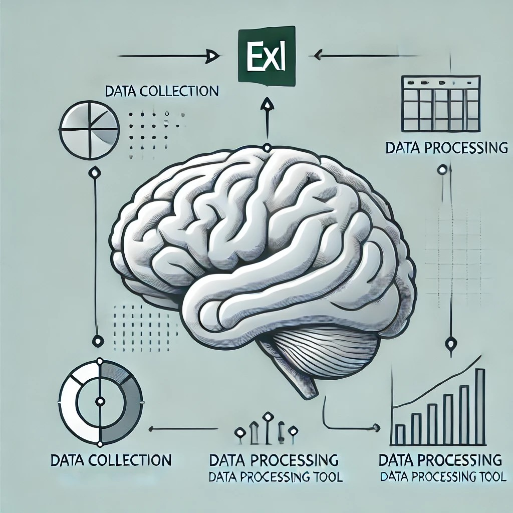
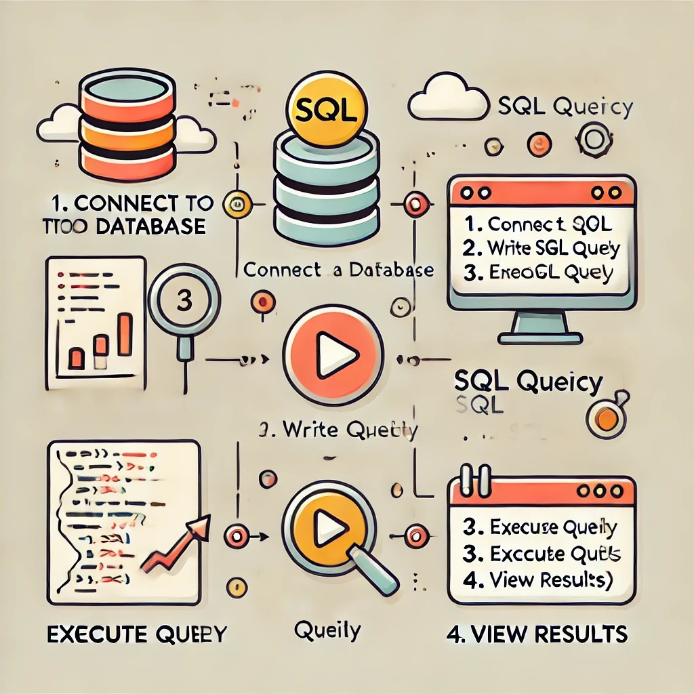

# 📈 Data Analyst BI

#### About Me : 

#### Technical Skills : Power Query & Pivot | Power BI | SQL | R | QlikView | Tableau 

## 🎓 Education
- **Data Analyst BI [ENSAE-ENSAI, Openclassrooms] RNCP Level 6** : (_09/2023 - Present_) ;   
- **M.S., Demography (Social Sciences) [University of Strasbourg]** : (_09/2020 -12/2022_) ;    
- **B.S., Demography (Social Sciences) [University of Strasbourg]** : (_09/2019 - 05/2020_) ;    
- **Pro. B.S., Statistics (Data Science) [University of Abomey-Calavi]** : (_01/2014 - 01/2018_) ;    

## 💼 Work Experience
- **Operational Performance Assitant [TDF North-Est]** : _09/2023 - Present_
  -   _Organization, conservation and traceability of Data_ ;
  -   _Consolidation and optimization of Data on the activity of Opearations Department_ ;
  -   _Participation in the overhaul of the national Scorecard on activity performance_ ;
  -   _Creation of dashboards for daily team activity monitoring_ :
      -   _Preventive Safety Maintenance MPS_,  
      -   _High Point Service for pylons and sites SPH_,
      -   _Beacon intervention request by RIS (Site Infrastructure Manager)_,
      -   _DAB+ (Digital Audio Broadcasting Plus)_,
      -   _RUHD (Radio Ultra High Definition)_ ... ;  
  -   _Initiation of training sessions for collaborators on using the BI tool_ ; 
    
- **Socio-Economic Studies Officer [CCAS HORBOURG-WHIR]** : _02/2022 - 08/2022_
  -   _Territorial diagnostics demonstrating the revitalization of community with young couples_,
  -   _Survey to identify the needs of new arrivals_,
  -   _Creation of dashboard to monitor aid request form residents ;  
    
- **Statistician [CARSAT ALSACE-MOSELLE]** : _06/2021 - 07/2021_
  -   _Extraction and cleaning of study Database BOXI_ ;  
  -   _Data analysis on non-take-up of survivor's pension_ ;  
    
- **Census Agent [INSEE/EUROMETROPOLIS OF STRASBOURG]** : _01/2020 - 02/2021_
  -   _Data collection from the residents of the Eurometropolis_ ;  
    
- **Assistant Statistician [DSA - BENIN]** : _06/2018 - 02/2019_
  -   _Data collection, processing and control of survey Data_ ;  
  -   _Writing reports and survey guides_ ;  
  -   _Creation, processing and management of Database_ ;  
    

## 🚀 Projets 
-  P1: Visualize data with Excel

    

     
     
  
    
    -  _Customers leaving Primero Bank are mainly older, married, wealthy, and educated individuals who use premium bank cards but are less active, engage more with the bank, and are dissatisfied with the services_ ; 

-  P2: Query a database with SQL

    

     
     
  
    
    -  _85% of contracts cover primary residences, mainly in Île-de-France, with rates varying based on location and property value_ ; 
    -  _Adapt offers, adjust rates based on seniority, and improve customer support_ ;

-  P3: Collect data while respecting GDPR standards

    

     
     
  
    
    -  _The data processing applied to DEV’IMMEDIAT ensures compliance with GDPR through anonymization and the security of sensitive information_ ;  
    -  _Establish a data processing register and organize workshops to ensure continuous improvement_ ;  

-  P4: Query a database with SQL to track customer satisfaction

    

     
     
  
    
    -  _More than half of BestMarket stores have a satisfaction rating above the average (8.05/10), with high-tech products and after-sales service receiving the best feedback_ ;
    -  _However, 44% of stores score below this average, and services like delivery and drive-through remain underdeveloped_ ;
    -  _Enhance customer proximity, optimize delivery and drive-through services, and strengthen communication to better meet customer expectations_ ;  

-  P5: Optimize store inventory management by cleaning its data

    

     
     
  
    
    -  _The analysis of Bottleneck's stock reveals a homogeneous price range with atypical values for prestigious bottles, as well as a revenue of €70,318.6 from only 3% of items sold_ ;
    -  _Despite the strong share of online sales (86.89%), inconsistencies persist in data quality and consolidation_ ;
    -  _Implement a centralized system for real-time stock and sales tracking to optimize management and improve data quality_ ;  

-  P6: Create a dynamic Dashboard with Power BI to track project progress

    

     
     
  
      
    -  _The "Project Progress and Performance Monitoring" dashboard evaluates Sanitoral's IT and Marketing projects by providing key stakeholders with an overview of key indicators (costs, deadlines, deliverables)_ ;  
    -  _To enhance its effectiveness, it is recommended to integrate an alert system to quickly detect budget overruns and delays while ensuring easy access to data for better strategic decision-making_ ;  

-  P7: Analyze real estate price trends with Python
  
    

     
     
  
    
    -  _The analysis of real estate price trends from 2017 to 2021 shows a steady increase in price per square meter, especially for apartments, along with a decline in transactions_ ;  
    -  _The predictive study confirms that commercial properties are more profitable than apartments, with the classification model achieving a strong performance (95.8%)_ ;
    -  _To optimize investments, it is recommended to maintain the supply of apartments, diversify the commercial property portfolio, and adjust rental values based on market trends using a tracking and modeling tool_ ;  

## 💻 Languages and Tools
<!DOCTYPE html>
<html lang="fr">
<head>
    <meta charset="UTF-8">
    <meta name="viewport" content="width=device-width, initial-scale=1.0">
    <title>Icônes des Logiciels et Langages</title>
    
</head>
<body>
    

        
        
        
        
        
        
        
        
        
        
        
        
        
    

</body>
</html>

